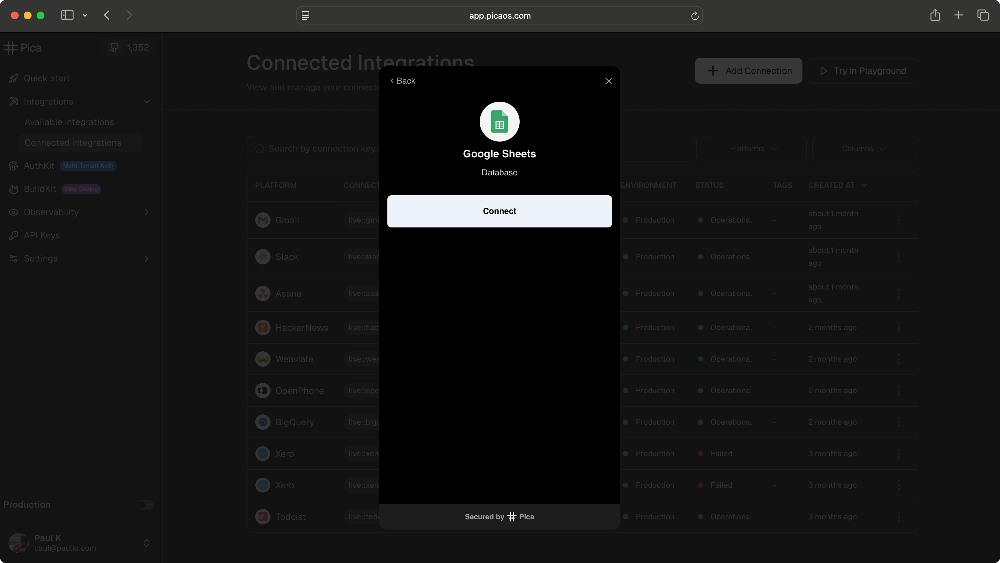

# AuthKit Next.js Demo App



This is a [Next.js](https://nextjs.org) project bootstrapped with [`create-next-app`](https://nextjs.org/docs/app/api-reference/cli/create-next-app) to showcase using [AuthKit](https://docs.picaos.com/core/authkit).

## What is AuthKit?

AuthKit is a drop-in component that handles third-party authentication for your users that works with all major frontend frameworks. Instead of building OAuth flows and managing credentials for dozens of platforms, you can embed AuthKit and let your users securely connect their Gmail, Slack, Salesforce, QuickBooks, and other accounts in minutes. **It's essentially Plaid, but for integrations.**

Want to see it in action? Pica uses AuthKit for its own connection flows. Head over to [Pica's dashboard](https://app.picaos.com/connections), create a free account, and click "Add Connection" under the Connected Integrations tab to experience AuthKit firsthand.


## Setup

Add the `PICA_SECRET_KEY` to the `.env` file. You can copy it from the [Pica Dashboard](https://app.picaos.com/settings/api-keys).

## Running

Run the development server

```bash
npm run dev
# or
yarn dev
# or
pnpm dev
# or
bun dev
```

The app will be running on PORT 3000 🎉

## Learn More

Read the [AuthKit documentation](https://docs.picaos.com/authkit).
